# LLM – Folienskript mit Bildern und Demos

Dieses Dokument zeigt **alle Folien der Präsentation** als eingebettete PNG-Bilder.
Unter jeder Folie steht eine kurze inhaltliche Einordnung und – falls vorhanden –
Links zu passenden Python-Demos im Ordner `demos/`.

---

## Folie 2

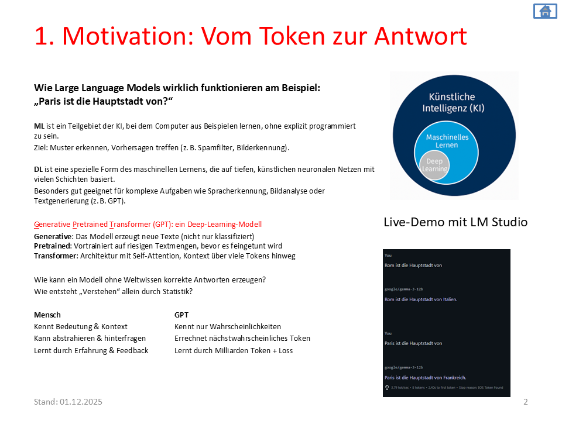

**Kurze Einordnung:**  
Motivation und Einordnung von Machine Learning, Deep Learning und GPT.

**Hinweis für die Lehre:**  
Ergänze bei Bedarf noch stichpunktartig Beispiele, Fragen oder Aufgaben,
die du zu dieser Folie stellen möchtest.

---

## Folie 3

**Kurze Einordnung:**  
Motivation und Einordnung von Machine Learning, Deep Learning und GPT.

**Hinweis für die Lehre:**  
Ergänze bei Bedarf noch stichpunktartig Beispiele, Fragen oder Aufgaben,
die du zu dieser Folie stellen möchtest.

---

## Folie 4

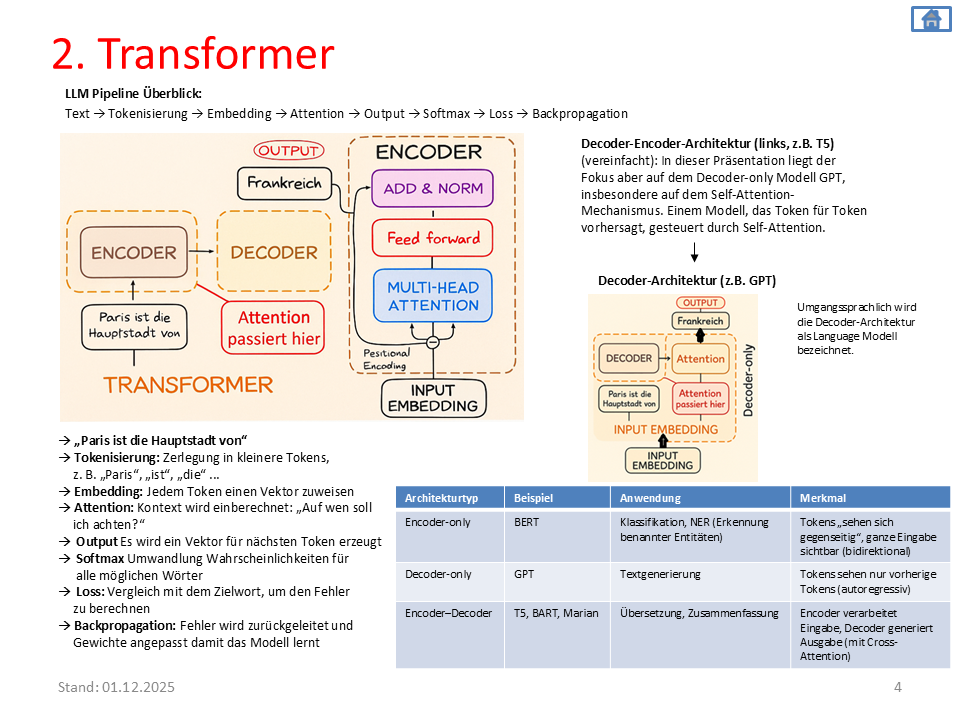

**Kurze Einordnung:**  
Motivation und Einordnung von Machine Learning, Deep Learning und GPT.

**Hinweis für die Lehre:**  
Ergänze bei Bedarf noch stichpunktartig Beispiele, Fragen oder Aufgaben,
die du zu dieser Folie stellen möchtest.

---

## Folie 5

**Kurze Einordnung:**  
Überblick über die Transformer-Architektur, die LLM-Pipeline und Self-Attention.

**Passende Demo-Programme:**

- 👉 [`tokenization_demo.py` (GitHub)](https://github.com/karkessler/llm/blob/main/demos/tokenization_demo.py)
- 🚀 [`tokenization_demo.py` in Binder öffnen (manuell ausführen)](https://mybinder.org/v2/gh/karkessler/llm/HEAD?urlpath=lab/tree/demos/tokenization_demo.py)

**Hinweis für die Lehre:**  
Ergänze bei Bedarf noch stichpunktartig Beispiele, Fragen oder Aufgaben,
die du zu dieser Folie stellen möchtest.

---

## Folie 6

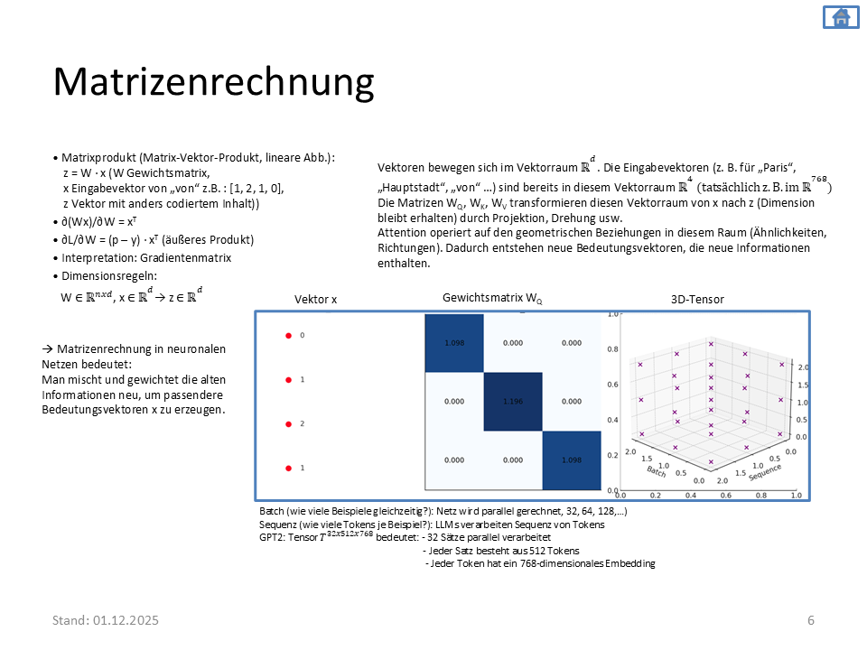

**Kurze Einordnung:**  
Überblick über die Transformer-Architektur, die LLM-Pipeline und Self-Attention.

**Passende Demo-Programme:**

- 👉 [`tokenization_demo.py` (GitHub)](https://github.com/karkessler/llm/blob/main/demos/tokenization_demo.py)
- 🚀 [`tokenization_demo.py` in Binder öffnen (manuell ausführen)](https://mybinder.org/v2/gh/karkessler/llm/HEAD?urlpath=lab/tree/demos/tokenization_demo.py)

**Hinweis für die Lehre:**  
Ergänze bei Bedarf noch stichpunktartig Beispiele, Fragen oder Aufgaben,
die du zu dieser Folie stellen möchtest.

---

## Folie 7

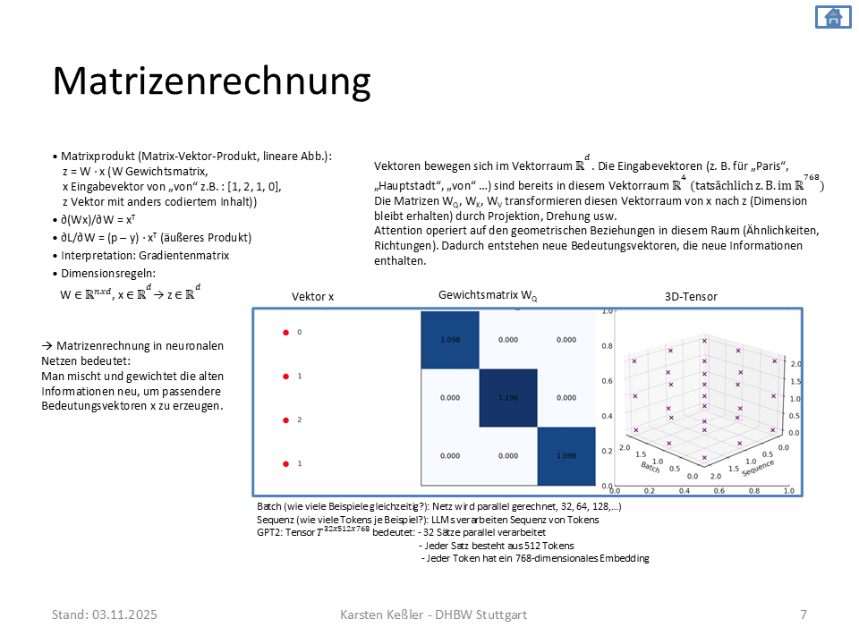

**Kurze Einordnung:**  
Überblick über die Transformer-Architektur, die LLM-Pipeline und Self-Attention.

**Passende Demo-Programme:**

- 👉 [`tokenization_demo.py` (GitHub)](https://github.com/karkessler/llm/blob/main/demos/tokenization_demo.py)
- 🚀 [`tokenization_demo.py` in Binder öffnen (manuell ausführen)](https://mybinder.org/v2/gh/karkessler/llm/HEAD?urlpath=lab/tree/demos/tokenization_demo.py)

**Hinweis für die Lehre:**  
Ergänze bei Bedarf noch stichpunktartig Beispiele, Fragen oder Aufgaben,
die du zu dieser Folie stellen möchtest.

---

## Folie 8

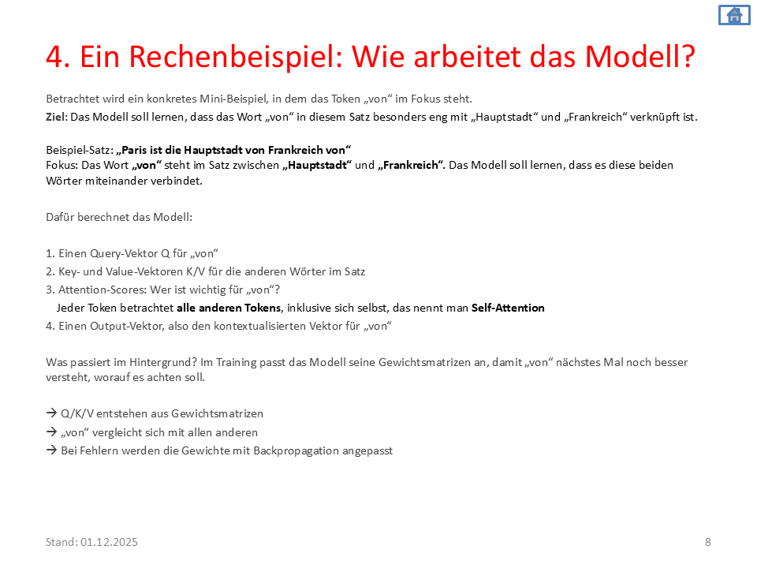

**Kurze Einordnung:**  
Überblick über die Transformer-Architektur, die LLM-Pipeline und Self-Attention.

**Passende Demo-Programme:**

- 👉 [`tokenization_demo.py` (GitHub)](https://github.com/karkessler/llm/blob/main/demos/tokenization_demo.py)
- 🚀 [`tokenization_demo.py` in Binder öffnen (manuell ausführen)](https://mybinder.org/v2/gh/karkessler/llm/HEAD?urlpath=lab/tree/demos/tokenization_demo.py)

**Hinweis für die Lehre:**  
Ergänze bei Bedarf noch stichpunktartig Beispiele, Fragen oder Aufgaben,
die du zu dieser Folie stellen möchtest.

---

## Folie 9

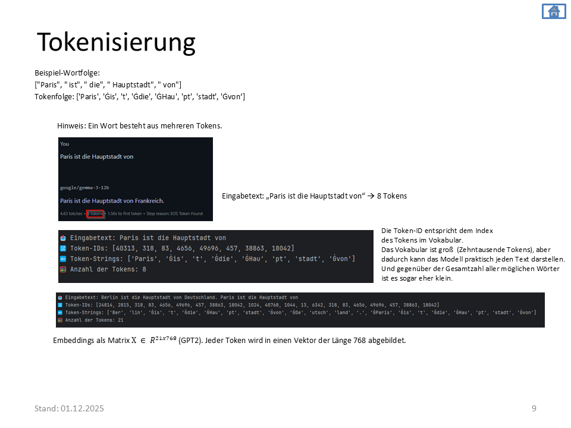

**Kurze Einordnung:**  
Überblick über die Transformer-Architektur, die LLM-Pipeline und Self-Attention.

**Passende Demo-Programme:**

- 👉 [`tokenization_demo.py` (GitHub)](https://github.com/karkessler/llm/blob/main/demos/tokenization_demo.py)
- 🚀 [`tokenization_demo.py` in Binder öffnen (manuell ausführen)](https://mybinder.org/v2/gh/karkessler/llm/HEAD?urlpath=lab/tree/demos/tokenization_demo.py)

**Hinweis für die Lehre:**  
Ergänze bei Bedarf noch stichpunktartig Beispiele, Fragen oder Aufgaben,
die du zu dieser Folie stellen möchtest.

---

## Folie 10

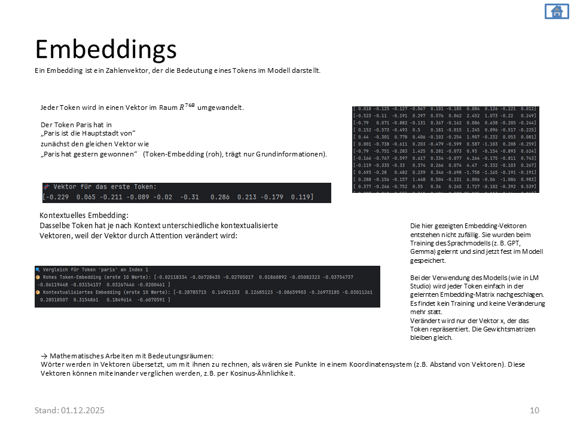

**Kurze Einordnung:**  
Überblick über die Transformer-Architektur, die LLM-Pipeline und Self-Attention.

**Passende Demo-Programme:**

- 👉 [`tokenization_demo.py` (GitHub)](https://github.com/karkessler/llm/blob/main/demos/tokenization_demo.py)
- 🚀 [`tokenization_demo.py` in Binder öffnen (manuell ausführen)](https://mybinder.org/v2/gh/karkessler/llm/HEAD?urlpath=lab/tree/demos/tokenization_demo.py)

**Hinweis für die Lehre:**  
Ergänze bei Bedarf noch stichpunktartig Beispiele, Fragen oder Aufgaben,
die du zu dieser Folie stellen möchtest.

---

## Folie 11

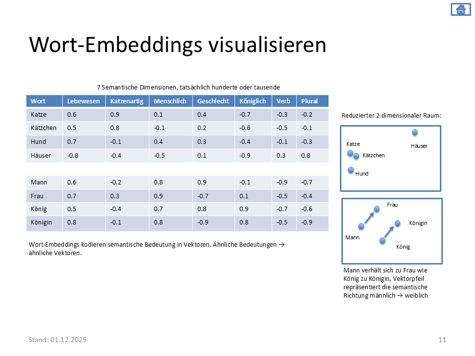

**Kurze Einordnung:**  
Mathematische Grundlagen: Vektoren, Matrizen, Gradienten und Loss-Landschaft.

**Passende Demo-Programme:**

- 👉 [`gradient_descent_demo.py` (GitHub)](https://github.com/karkessler/llm/blob/main/demos/gradient_descent_demo.py)
- 🚀 [`gradient_descent_demo.py` in Binder öffnen (manuell ausführen)](https://mybinder.org/v2/gh/karkessler/llm/HEAD?urlpath=lab/tree/demos/gradient_descent_demo.py)

**Hinweis für die Lehre:**  
Ergänze bei Bedarf noch stichpunktartig Beispiele, Fragen oder Aufgaben,
die du zu dieser Folie stellen möchtest.

---

## Folie 12

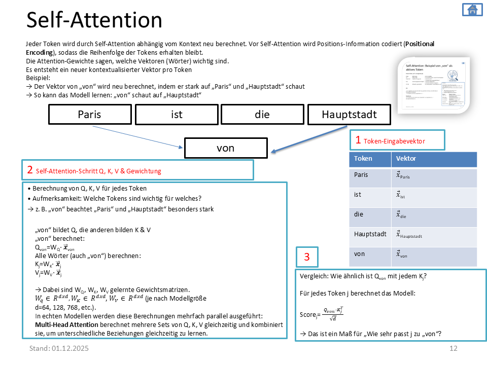

**Kurze Einordnung:**  
Mathematische Grundlagen: Vektoren, Matrizen, Gradienten und Loss-Landschaft.

**Passende Demo-Programme:**

- 👉 [`gradient_descent_demo.py` (GitHub)](https://github.com/karkessler/llm/blob/main/demos/gradient_descent_demo.py)
- 🚀 [`gradient_descent_demo.py` in Binder öffnen (manuell ausführen)](https://mybinder.org/v2/gh/karkessler/llm/HEAD?urlpath=lab/tree/demos/gradient_descent_demo.py)

**Hinweis für die Lehre:**  
Ergänze bei Bedarf noch stichpunktartig Beispiele, Fragen oder Aufgaben,
die du zu dieser Folie stellen möchtest.
---

## Folie 13

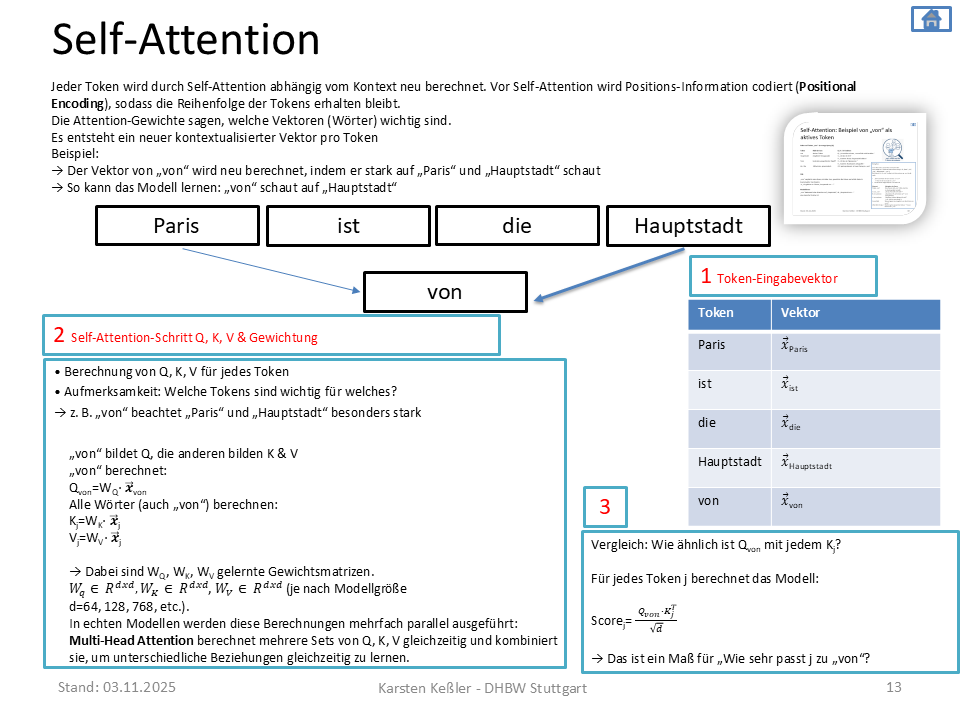

**Kurze Einordnung:**  
Mathematische Grundlagen: Vektoren, Matrizen, Gradienten und Loss-Landschaft.

**Passende Demo-Programme:**

- 👉 [`gradient_descent_demo.py` (GitHub)](https://github.com/karkessler/llm/blob/main/demos/gradient_descent_demo.py)
- 🚀 [`gradient_descent_demo.py` in Binder öffnen (manuell ausführen)](https://mybinder.org/v2/gh/karkessler/llm/HEAD?urlpath=lab/tree/demos/gradient_descent_demo.py)

**Hinweis für die Lehre:**  
Ergänze bei Bedarf noch stichpunktartig Beispiele, Fragen oder Aufgaben,
die du zu dieser Folie stellen möchtest.

---

## Folie 14

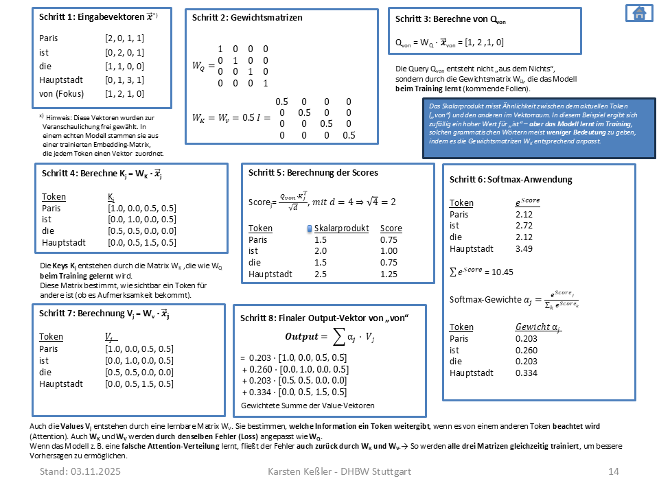

**Kurze Einordnung:**  
Mathematische Grundlagen: Vektoren, Matrizen, Gradienten und Loss-Landschaft.

**Passende Demo-Programme:**

- 👉 [`gradient_descent_demo.py` (GitHub)](https://github.com/karkessler/llm/blob/main/demos/gradient_descent_demo.py)
- 🚀 [`gradient_descent_demo.py` in Binder öffnen (manuell ausführen)](https://mybinder.org/v2/gh/karkessler/llm/HEAD?urlpath=lab/tree/demos/gradient_descent_demo.py)

**Hinweis für die Lehre:**  
Ergänze bei Bedarf noch stichpunktartig Beispiele, Fragen oder Aufgaben,
die du zu dieser Folie stellen möchtest.
---

## Folie 15

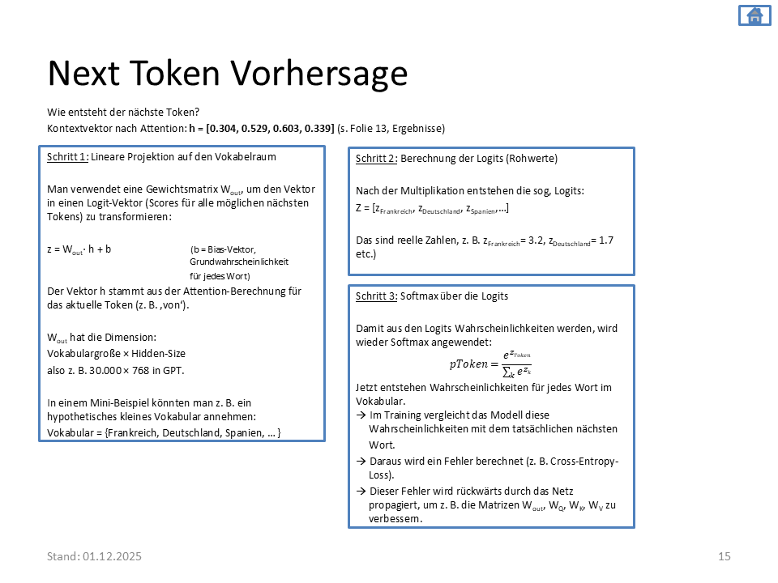

**Kurze Einordnung:**  
Mathematische Grundlagen: Vektoren, Matrizen, Gradienten und Loss-Landschaft.

**Passende Demo-Programme:**

- 👉 [`gradient_descent_demo.py` (GitHub)](https://github.com/karkessler/llm/blob/main/demos/gradient_descent_demo.py)
- 🚀 [`gradient_descent_demo.py` in Binder öffnen (manuell ausführen)](https://mybinder.org/v2/gh/karkessler/llm/HEAD?urlpath=lab/tree/demos/gradient_descent_demo.py)

**Hinweis für die Lehre:**  
Ergänze bei Bedarf noch stichpunktartig Beispiele, Fragen oder Aufgaben,
die du zu dieser Folie stellen möchtest.
---

## Folie 16

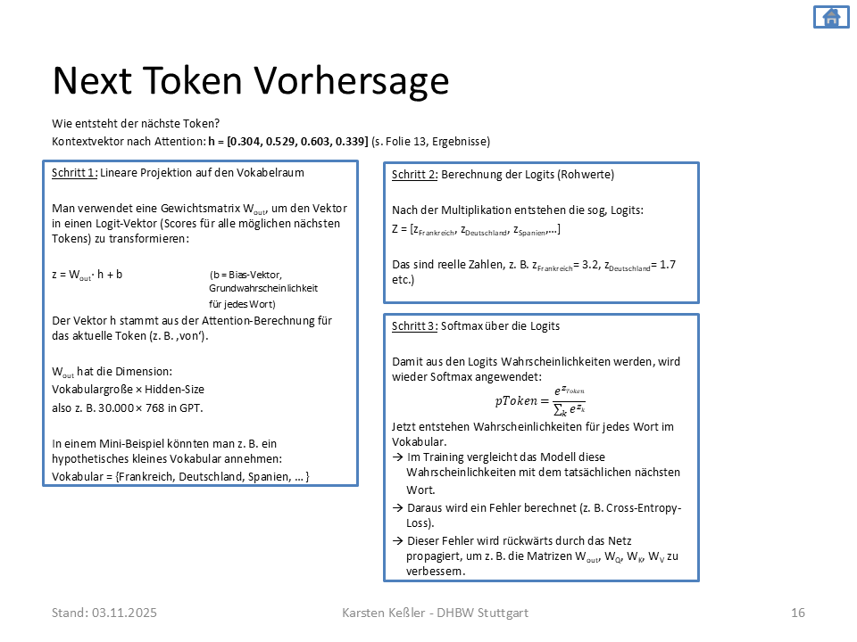

**Kurze Einordnung:**  
Konkretes Rechenbeispiel zur Self-Attention und zum Kontextvektor (Token „von“).

**Passende Demo-Programme:**

- 👉 [`self_attention_demo.py` (GitHub)](https://github.com/karkessler/llm/blob/main/demos/self_attention_demo.py)
- 🚀 [`self_attention_demo.py` in Binder öffnen (manuell ausführen)](https://mybinder.org/v2/gh/karkessler/llm/HEAD?urlpath=lab/tree/demos/self_attention_demo.py)

**Hinweis für die Lehre:**  
Ergänze bei Bedarf noch stichpunktartig Beispiele, Fragen oder Aufgaben,
die du zu dieser Folie stellen möchtest.
---

## Folie 17

**Kurze Einordnung:**  
Konkretes Rechenbeispiel zur Self-Attention und zum Kontextvektor (Token „von“).

**Passende Demo-Programme:**

- 👉 [`self_attention_demo.py` (GitHub)](https://github.com/karkessler/llm/blob/main/demos/self_attention_demo.py)
- 🚀 [`self_attention_demo.py` in Binder öffnen (manuell ausführen)](https://mybinder.org/v2/gh/karkessler/llm/HEAD?urlpath=lab/tree/demos/self_attention_demo.py)

**Hinweis für die Lehre:**  
Ergänze bei Bedarf noch stichpunktartig Beispiele, Fragen oder Aufgaben,
die du zu dieser Folie stellen möchtest.

---

## Folie 18

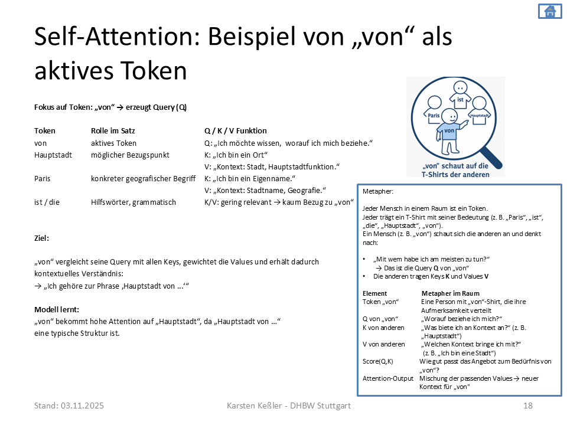

**Kurze Einordnung:**  
Konkretes Rechenbeispiel zur Self-Attention und zum Kontextvektor (Token „von“).

**Passende Demo-Programme:**

- 👉 [`self_attention_demo.py` (GitHub)](https://github.com/karkessler/llm/blob/main/demos/self_attention_demo.py)
- 🚀 [`self_attention_demo.py` in Binder öffnen (manuell ausführen)](https://mybinder.org/v2/gh/karkessler/llm/HEAD?urlpath=lab/tree/demos/self_attention_demo.py)

**Hinweis für die Lehre:**  
Ergänze bei Bedarf noch stichpunktartig Beispiele, Fragen oder Aufgaben,
die du zu dieser Folie stellen möchtest.

---

## Folie 19

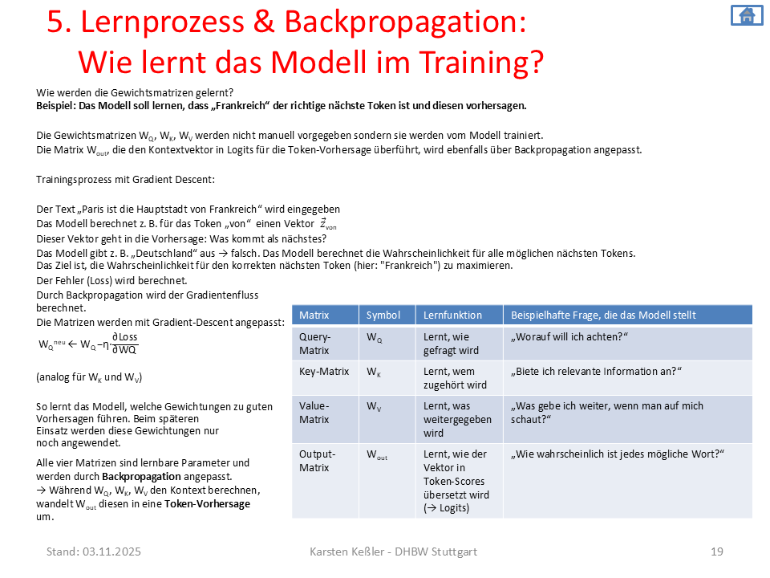

**Kurze Einordnung:**  
Konkretes Rechenbeispiel zur Self-Attention und zum Kontextvektor (Token „von“).

**Passende Demo-Programme:**

- 👉 [`self_attention_demo.py` (GitHub)](https://github.com/karkessler/llm/blob/main/demos/self_attention_demo.py)
- 🚀 [`self_attention_demo.py` in Binder öffnen (manuell ausführen)](https://mybinder.org/v2/gh/karkessler/llm/HEAD?urlpath=lab/tree/demos/self_attention_demo.py)

**Hinweis für die Lehre:**  
Ergänze bei Bedarf noch stichpunktartig Beispiele, Fragen oder Aufgaben,
die du zu dieser Folie stellen möchtest.
---

## Folie 20

**Kurze Einordnung:**  
Konkretes Rechenbeispiel zur Self-Attention und zum Kontextvektor (Token „von“).

**Passende Demo-Programme:**

- 👉 [`self_attention_demo.py` (GitHub)](https://github.com/karkessler/llm/blob/main/demos/self_attention_demo.py)
- 🚀 [`self_attention_demo.py` in Binder öffnen (manuell ausführen)](https://mybinder.org/v2/gh/karkessler/llm/HEAD?urlpath=lab/tree/demos/self_attention_demo.py)

**Hinweis für die Lehre:**  
Ergänze bei Bedarf noch stichpunktartig Beispiele, Fragen oder Aufgaben,
die du zu dieser Folie stellen möchtest.

---

## Folie 21

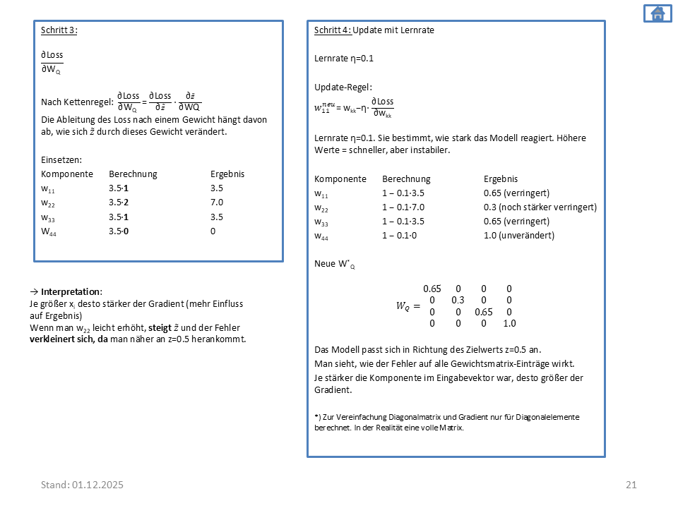

**Kurze Einordnung:**  
Lernprozess: Softmax, Cross-Entropy, Backpropagation und Gradientenabstieg.

**Passende Demo-Programme:**

- 👉 [`softmax_demo.py` (GitHub)](https://github.com/karkessler/llm/blob/main/demos/softmax_demo.py)
- 👉 [`crossentropy_demo.py` (GitHub)](https://github.com/karkessler/llm/blob/main/demos/crossentropy_demo.py)
- 🚀 [`softmax_demo.py` in Binder öffnen (manuell ausführen)](https://mybinder.org/v2/gh/karkessler/llm/HEAD?urlpath=lab/tree/demos/softmax_demo.py)
- 🚀 [`crossentropy_demo.py` in Binder öffnen (manuell ausführen)](https://mybinder.org/v2/gh/karkessler/llm/HEAD?urlpath=lab/tree/demos/crossentropy_demo.py)

**Hinweis für die Lehre:**  
EErgänze bei Bedarf noch stichpunktartig Beispiele, Fragen oder Aufgaben,
die du zu dieser Folie stellen möchtest.
---

## Folie 22

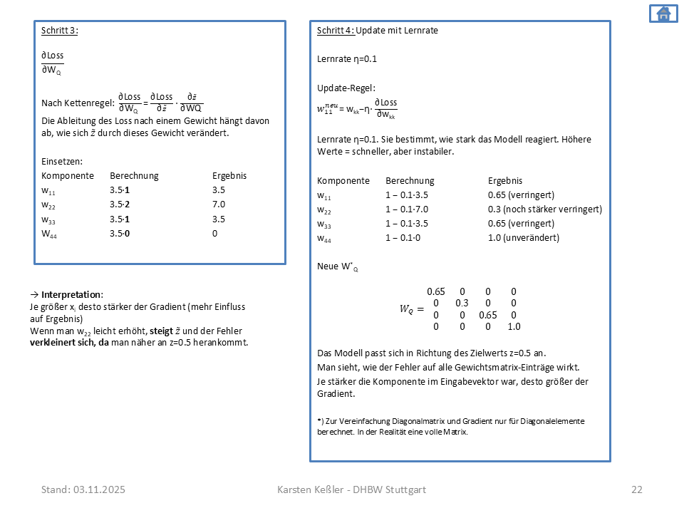

**Kurze Einordnung:**  
Lernprozess: Softmax, Cross-Entropy, Backpropagation und Gradientenabstieg.

**Passende Demo-Programme:**

- 👉 [`softmax_demo.py` (GitHub)](https://github.com/karkessler/llm/blob/main/demos/softmax_demo.py)
- 👉 [`crossentropy_demo.py` (GitHub)](https://github.com/karkessler/llm/blob/main/demos/crossentropy_demo.py)
- 🚀 [`softmax_demo.py` in Binder öffnen (manuell ausführen)](https://mybinder.org/v2/gh/karkessler/llm/HEAD?urlpath=lab/tree/demos/softmax_demo.py)
- 🚀 [`crossentropy_demo.py` in Binder öffnen (manuell ausführen)](https://mybinder.org/v2/gh/karkessler/llm/HEAD?urlpath=lab/tree/demos/crossentropy_demo.py)

**Hinweis für die Lehre:**  
Ergänze bei Bedarf noch stichpunktartig Beispiele, Fragen oder Aufgaben,
die du zu dieser Folie stellen möchtest.
---

## Folie 23

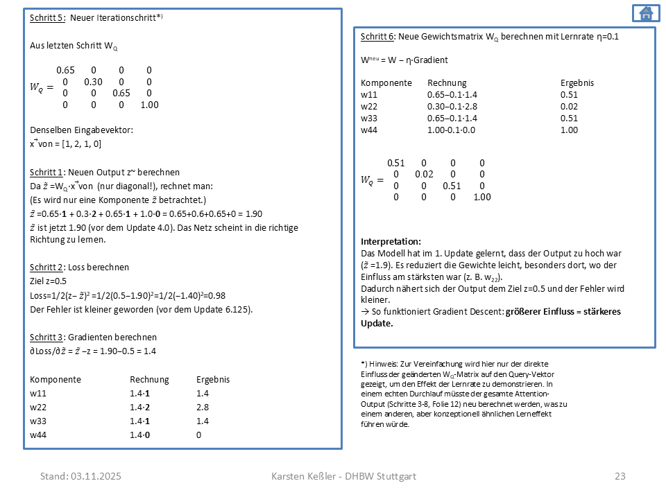

**Kurze Einordnung:**  
Lernprozess: Softmax, Cross-Entropy, Backpropagation und Gradientenabstieg.

**Passende Demo-Programme:**

- 👉 [`softmax_demo.py` (GitHub)](https://github.com/karkessler/llm/blob/main/demos/softmax_demo.py)
- 👉 [`crossentropy_demo.py` (GitHub)](https://github.com/karkessler/llm/blob/main/demos/crossentropy_demo.py)
- 🚀 [`softmax_demo.py` in Binder öffnen (manuell ausführen)](https://mybinder.org/v2/gh/karkessler/llm/HEAD?urlpath=lab/tree/demos/softmax_demo.py)
- 🚀 [`crossentropy_demo.py` in Binder öffnen (manuell ausführen)](https://mybinder.org/v2/gh/karkessler/llm/HEAD?urlpath=lab/tree/demos/crossentropy_demo.py)

**Hinweis für die Lehre:**  
Ergänze bei Bedarf noch stichpunktartig Beispiele, Fragen oder Aufgaben,
die du zu dieser Folie stellen möchtest.

---

## Folie 24

**Kurze Einordnung:**  
Lernprozess: Softmax, Cross-Entropy, Backpropagation und Gradientenabstieg.

**Passende Demo-Programme:**

- 👉 [`softmax_demo.py` (GitHub)](https://github.com/karkessler/llm/blob/main/demos/softmax_demo.py)
- 👉 [`crossentropy_demo.py` (GitHub)](https://github.com/karkessler/llm/blob/main/demos/crossentropy_demo.py)
- 🚀 [`softmax_demo.py` in Binder öffnen (manuell ausführen)](https://mybinder.org/v2/gh/karkessler/llm/HEAD?urlpath=lab/tree/demos/softmax_demo.py)
- 🚀 [`crossentropy_demo.py` in Binder öffnen (manuell ausführen)](https://mybinder.org/v2/gh/karkessler/llm/HEAD?urlpath=lab/tree/demos/crossentropy_demo.py)

**Hinweis für die Lehre:**  
Ergänze bei Bedarf noch stichpunktartig Beispiele, Fragen oder Aufgaben,
die du zu dieser Folie stellen möchtest.
---

## Folie 25

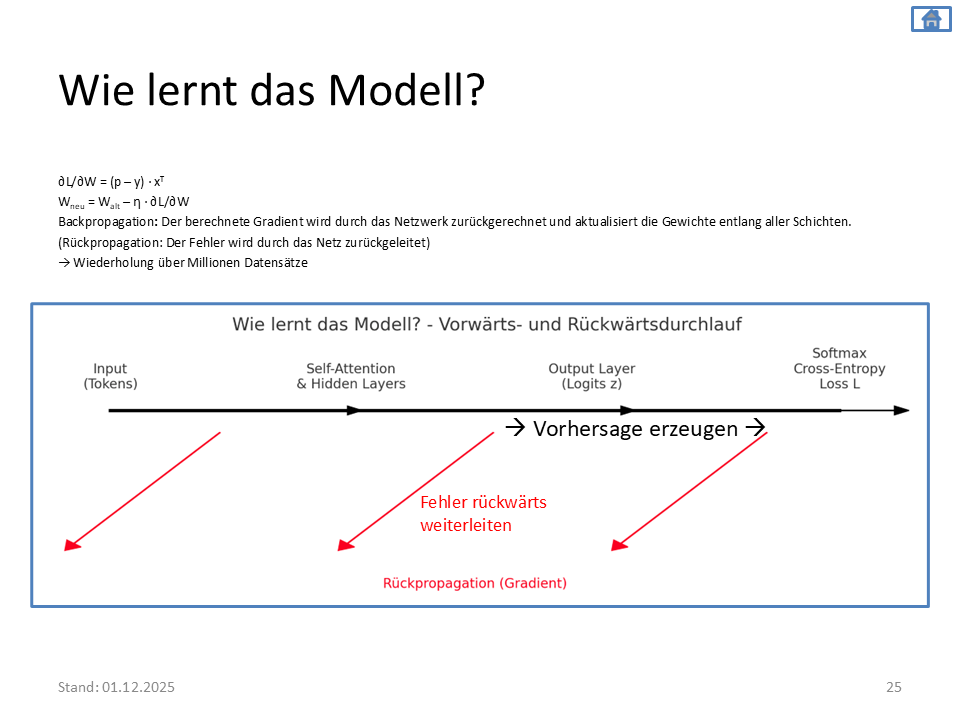

**Kurze Einordnung:**  
Lernprozess: Softmax, Cross-Entropy, Backpropagation und Gradientenabstieg.

**Passende Demo-Programme:**

- 👉 [`softmax_demo.py` (GitHub)](https://github.com/karkessler/llm/blob/main/demos/softmax_demo.py)
- 👉 [`crossentropy_demo.py` (GitHub)](https://github.com/karkessler/llm/blob/main/demos/crossentropy_demo.py)
- 🚀 [`softmax_demo.py` in Binder öffnen (manuell ausführen)](https://mybinder.org/v2/gh/karkessler/llm/HEAD?urlpath=lab/tree/demos/softmax_demo.py)
- 🚀 [`crossentropy_demo.py` in Binder öffnen (manuell ausführen)](https://mybinder.org/v2/gh/karkessler/llm/HEAD?urlpath=lab/tree/demos/crossentropy_demo.py)

**Hinweis für die Lehre:**  
Ergänze bei Bedarf noch stichpunktartig Beispiele, Fragen oder Aufgaben,
die du zu dieser Folie stellen möchtest.

---

## Folie 26

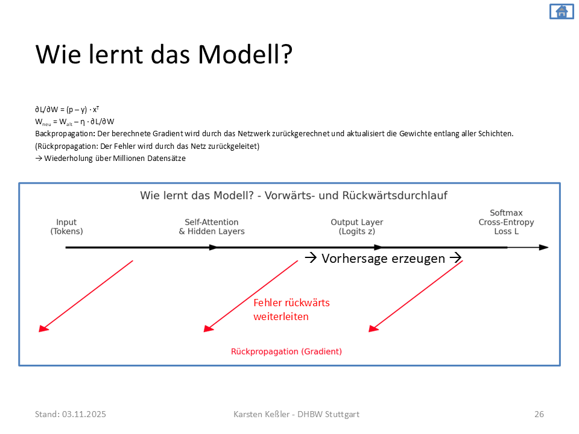

**Kurze Einordnung:**  
Lernprozess: Softmax, Cross-Entropy, Backpropagation und Gradientenabstieg.

**Passende Demo-Programme:**

- 👉 [`softmax_demo.py` (GitHub)](https://github.com/karkessler/llm/blob/main/demos/softmax_demo.py)
- 👉 [`crossentropy_demo.py` (GitHub)](https://github.com/karkessler/llm/blob/main/demos/crossentropy_demo.py)
- 🚀 [`softmax_demo.py` in Binder öffnen (manuell ausführen)](https://mybinder.org/v2/gh/karkessler/llm/HEAD?urlpath=lab/tree/demos/softmax_demo.py)
- 🚀 [`crossentropy_demo.py` in Binder öffnen (manuell ausführen)](https://mybinder.org/v2/gh/karkessler/llm/HEAD?urlpath=lab/tree/demos/crossentropy_demo.py)

**Hinweis für die Lehre:**  
Ergänze bei Bedarf noch stichpunktartig Beispiele, Fragen oder Aufgaben,
die du zu dieser Folie stellen möchtest.
---

## Folie 27

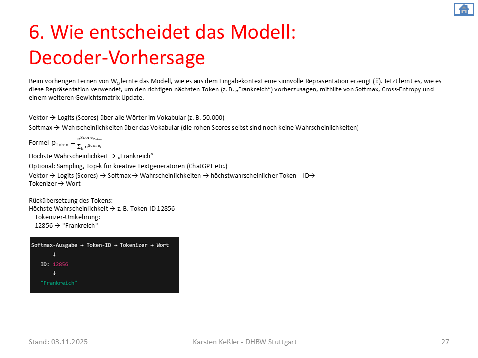

**Kurze Einordnung:**  
Lernprozess: Softmax, Cross-Entropy, Backpropagation und Gradientenabstieg.

**Passende Demo-Programme:**

- 👉 [`softmax_demo.py` (GitHub)](https://github.com/karkessler/llm/blob/main/demos/softmax_demo.py)
- 👉 [`crossentropy_demo.py` (GitHub)](https://github.com/karkessler/llm/blob/main/demos/crossentropy_demo.py)
- 🚀 [`softmax_demo.py` in Binder öffnen (manuell ausführen)](https://mybinder.org/v2/gh/karkessler/llm/HEAD?urlpath=lab/tree/demos/softmax_demo.py)
- 🚀 [`crossentropy_demo.py` in Binder öffnen (manuell ausführen)](https://mybinder.org/v2/gh/karkessler/llm/HEAD?urlpath=lab/tree/demos/crossentropy_demo.py)

**Hinweis für die Lehre:**  
Ergänze bei Bedarf noch stichpunktartig Beispiele, Fragen oder Aufgaben,
die du zu dieser Folie stellen möchtest.
---

## Folie 28

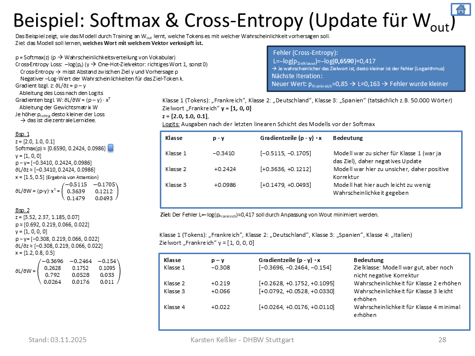

**Kurze Einordnung:**  
Vergleich von Modellarchitekturen (GPT/BERT) und Erweiterungen (Feedforward, Residuals, LayerNorm).

**Passende Demo-Programme:**

- 👉 [`self_attention_demo.py` (GitHub)](https://github.com/karkessler/llm/blob/main/demos/self_attention_demo.py)
- 🚀 [`self_attention_demo.py` in Binder öffnen (manuell ausführen)](https://mybinder.org/v2/gh/karkessler/llm/HEAD?urlpath=lab/tree/demos/self_attention_demo.py)

**Hinweis für die Lehre:**  
Ergänze bei Bedarf noch stichpunktartig Beispiele, Fragen oder Aufgaben,
die du zu dieser Folie stellen möchtest.

---

## Folie 29

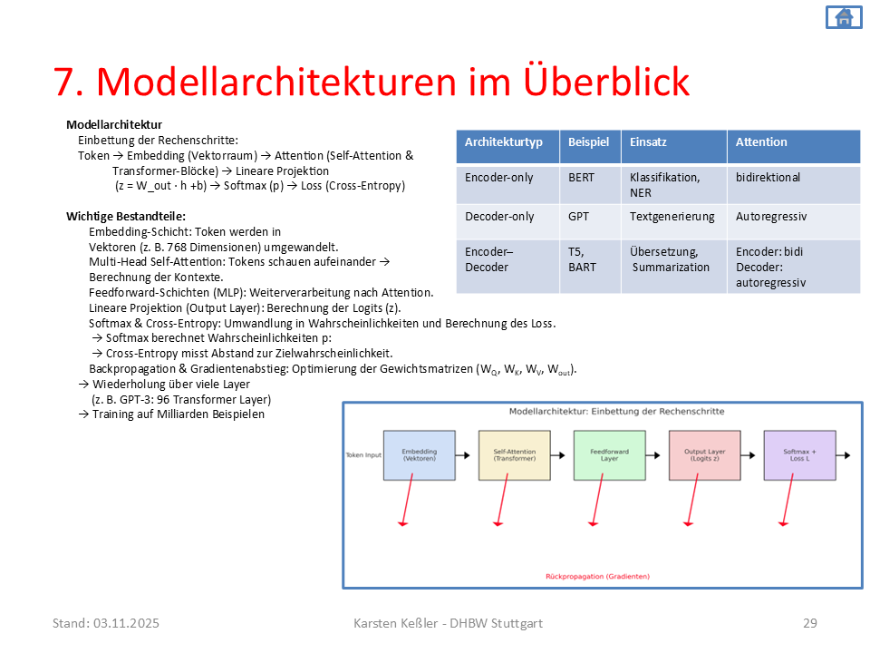

**Kurze Einordnung:**  
Vergleich von Modellarchitekturen (GPT/BERT) und Erweiterungen (Feedforward, Residuals, LayerNorm).

**Passende Demo-Programme:**

- 👉 [`self_attention_demo.py` (GitHub)](https://github.com/karkessler/llm/blob/main/demos/self_attention_demo.py)
- 🚀 [`self_attention_demo.py` in Binder öffnen (manuell ausführen)](https://mybinder.org/v2/gh/karkessler/llm/HEAD?urlpath=lab/tree/demos/self_attention_demo.py)

**Hinweis für die Lehre:**  
Ergänze bei Bedarf noch stichpunktartig Beispiele, Fragen oder Aufgaben,
die du zu dieser Folie stellen möchtest.

---

## Folie 30

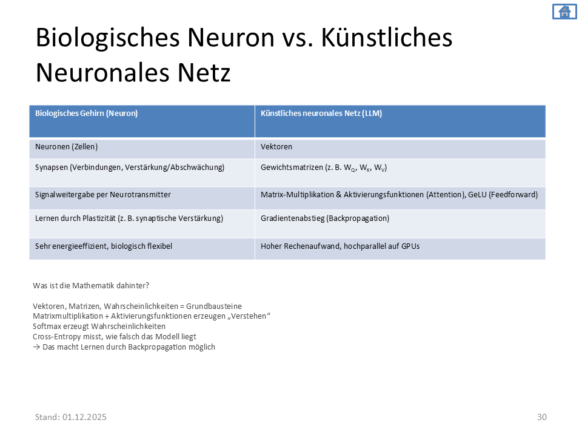

**Kurze Einordnung:**  
Vergleich von Modellarchitekturen (GPT/BERT) und Erweiterungen (Feedforward, Residuals, LayerNorm).

**Passende Demo-Programme:**

- 👉 [`self_attention_demo.py` (GitHub)](https://github.com/karkessler/llm/blob/main/demos/self_attention_demo.py)
- 🚀 [`self_attention_demo.py` in Binder öffnen (manuell ausführen)](https://mybinder.org/v2/gh/karkessler/llm/HEAD?urlpath=lab/tree/demos/self_attention_demo.py)

**Hinweis für die Lehre:**  
Ergänze bei Bedarf noch stichpunktartig Beispiele, Fragen oder Aufgaben,
die du zu dieser Folie stellen möchtest.

---

## Folie 31

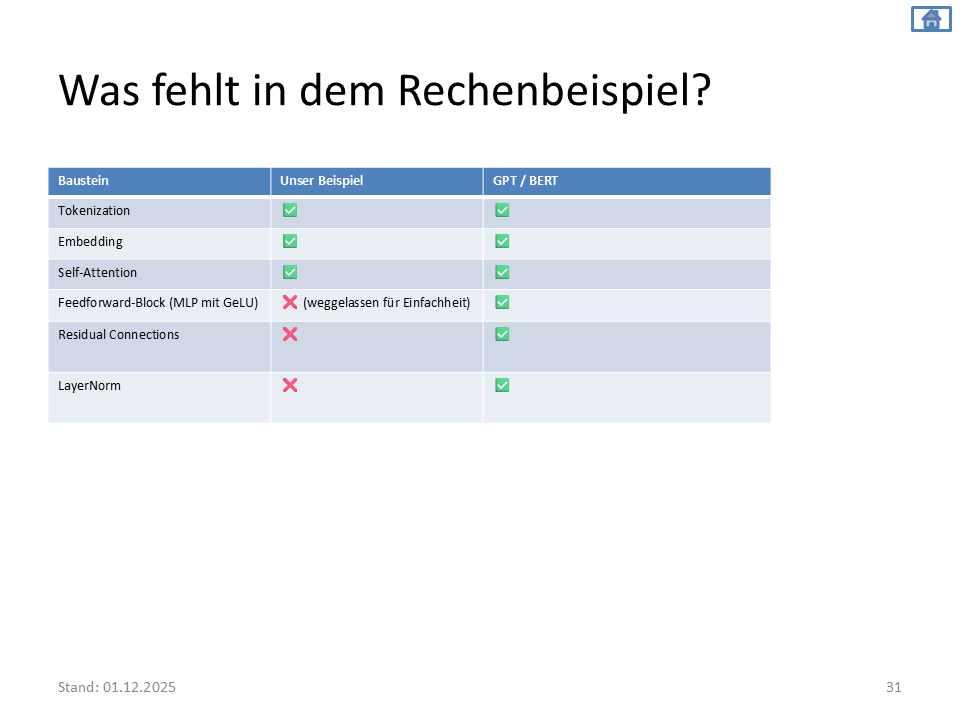

**Kurze Einordnung:**  
Vergleich von Modellarchitekturen (GPT/BERT) und Erweiterungen (Feedforward, Residuals, LayerNorm).

**Passende Demo-Programme:**

- 👉 [`self_attention_demo.py` (GitHub)](https://github.com/karkessler/llm/blob/main/demos/self_attention_demo.py)
- 🚀 [`self_attention_demo.py` in Binder öffnen (manuell ausführen)](https://mybinder.org/v2/gh/karkessler/llm/HEAD?urlpath=lab/tree/demos/self_attention_demo.py)

**Hinweis für die Lehre:**  
Ergänze bei Bedarf noch stichpunktartig Beispiele, Fragen oder Aufgaben,
die du zu dieser Folie stellen möchtest.
---

## Folie 32

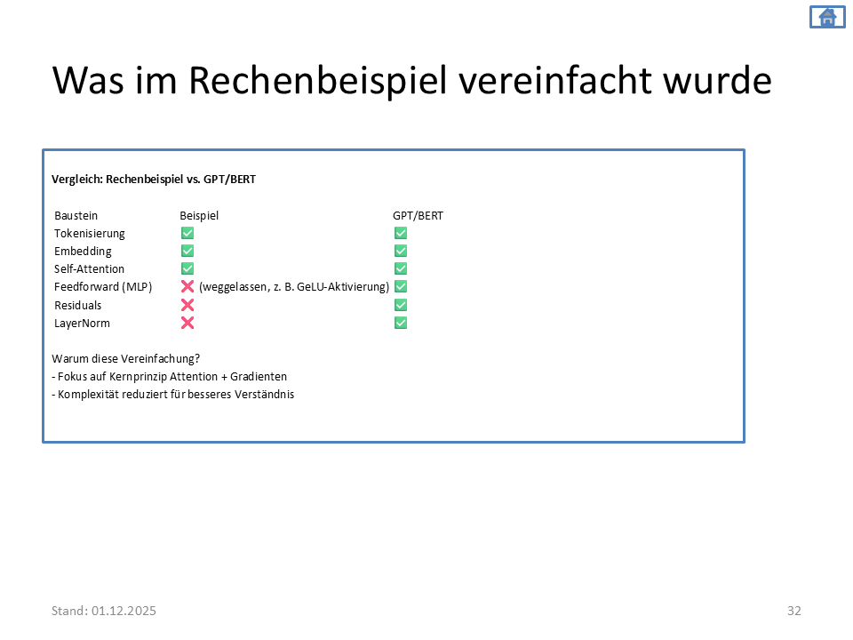

**Kurze Einordnung:**  
Vergleich von Modellarchitekturen (GPT/BERT) und Erweiterungen (Feedforward, Residuals, LayerNorm).

**Passende Demo-Programme:**

- 👉 [`self_attention_demo.py` (GitHub)](https://github.com/karkessler/llm/blob/main/demos/self_attention_demo.py)
- 🚀 [`self_attention_demo.py` in Binder öffnen (manuell ausführen)](https://mybinder.org/v2/gh/karkessler/llm/HEAD?urlpath=lab/tree/demos/self_attention_demo.py)

**Hinweis für die Lehre:**  
Ergänze bei Bedarf noch stichpunktartig Beispiele, Fragen oder Aufgaben,
die du zu dieser Folie stellen möchtest.
---

## Folie 33

**Kurze Einordnung:**  
Titans-Architektur und Memory-Konzepte (Short-Term, Long-Term, Persistent Memory).

**Hinweis für die Lehre:**  
Ergänze bei Bedarf noch stichpunktartig Beispiele, Fragen oder Aufgaben,
die du zu dieser Folie stellen möchtest.
---

## Folie 34

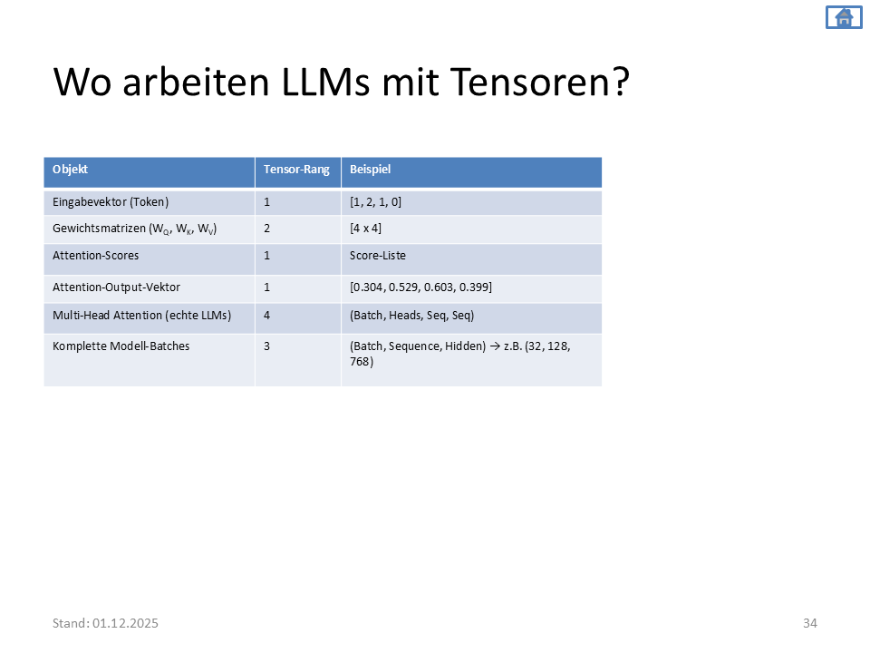

**Kurze Einordnung:**  
Titans-Architektur und Memory-Konzepte (Short-Term, Long-Term, Persistent Memory).

**Hinweis für die Lehre:**  
Ergänze bei Bedarf noch stichpunktartig Beispiele, Fragen oder Aufgaben,
die du zu dieser Folie stellen möchtest.

---

## Folie 36

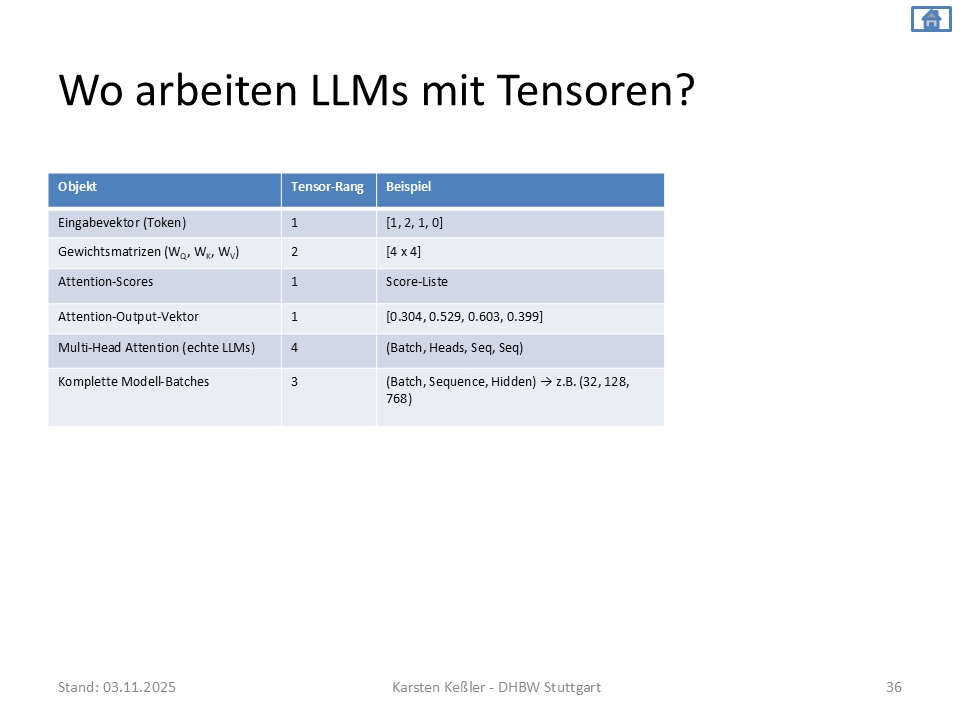

**Kurze Einordnung:**  
Titans-Architektur und Memory-Konzepte (Short-Term, Long-Term, Persistent Memory).

**Hinweis für die Lehre:**  
Ergänze bei Bedarf noch stichpunktartig Beispiele, Fragen oder Aufgaben,
die du zu dieser Folie stellen möchtest.

---

## Folie 37

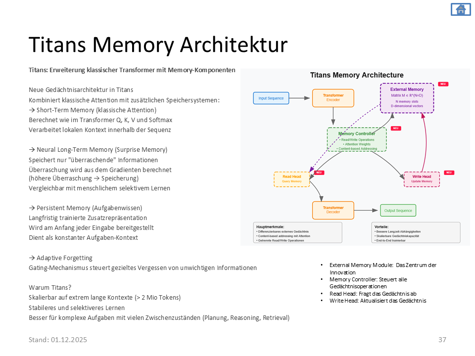

**Kurze Einordnung:**  
Titans-Architektur und Memory-Konzepte (Short-Term, Long-Term, Persistent Memory).

**Hinweis für die Lehre:**  
Ergänze bei Bedarf noch stichpunktartig Beispiele, Fragen oder Aufgaben,
die du zu dieser Folie stellen möchtest.
---

## Folie 38

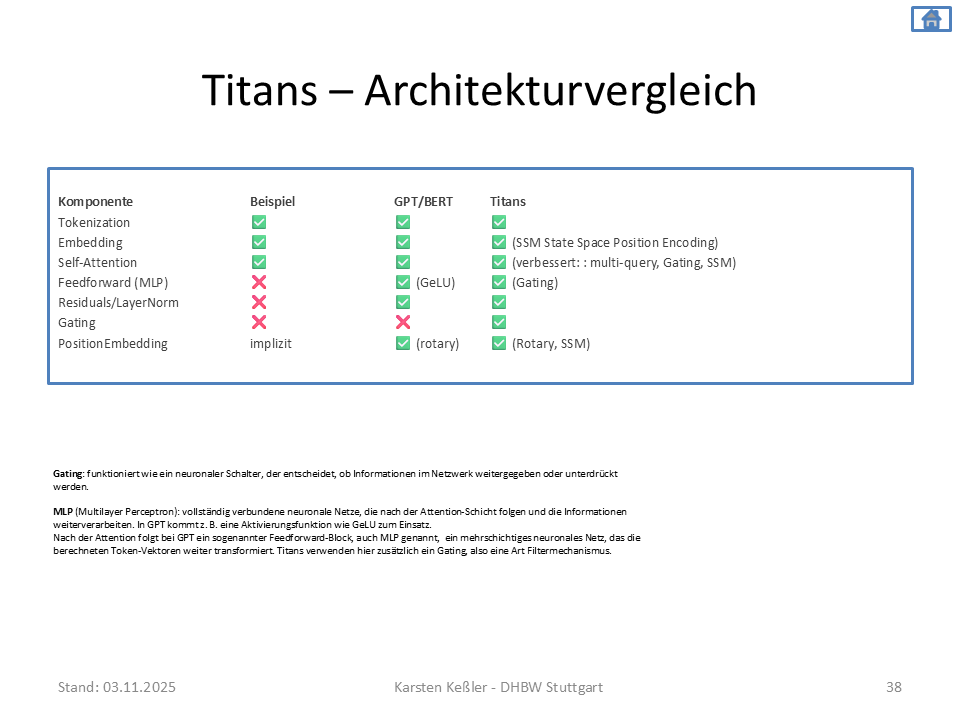

**Kurze Einordnung:**  
Titans-Architektur und Memory-Konzepte (Short-Term, Long-Term, Persistent Memory).

**Hinweis für die Lehre:**  
Ergänze bei Bedarf noch stichpunktartig Beispiele, Fragen oder Aufgaben,
die du zu dieser Folie stellen möchtest.
---

## Folie 39

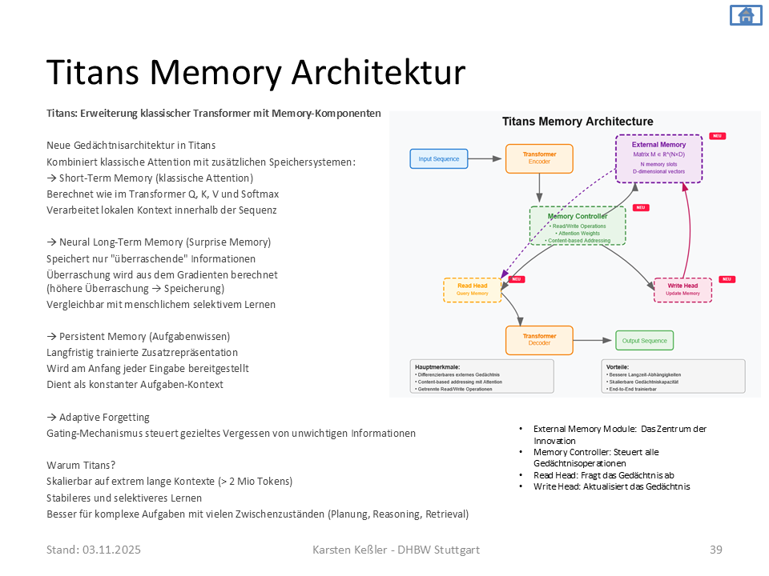

**Kurze Einordnung:**  
Grenzen von LLMs, Fazit, Ausblick und Glossar wichtiger Begriffe.

**Hinweis für die Lehre:**  
Ergänze bei Bedarf noch stichpunktartig Beispiele, Fragen oder Aufgaben,
die du zu dieser Folie stellen möchtest.

---

## Folie 40

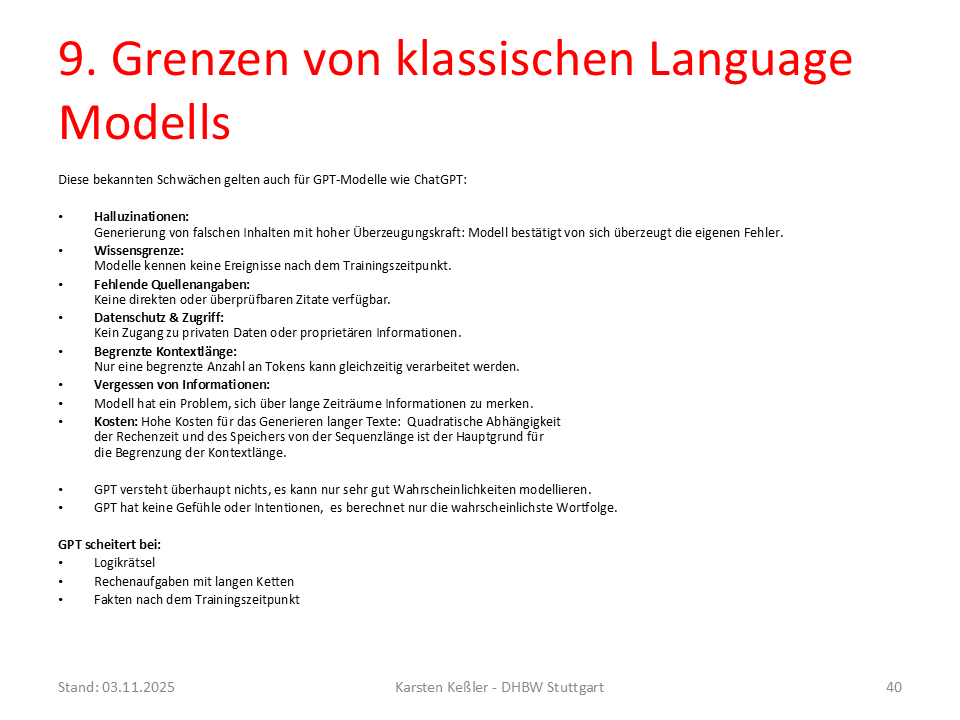

**Kurze Einordnung:**  
Grenzen von LLMs, Fazit, Ausblick und Glossar wichtiger Begriffe.

**Hinweis für die Lehre:**  
Ergänze bei Bedarf noch stichpunktartig Beispiele, Fragen oder Aufgaben,
die du zu dieser Folie stellen möchtest.

---

## Folie 41

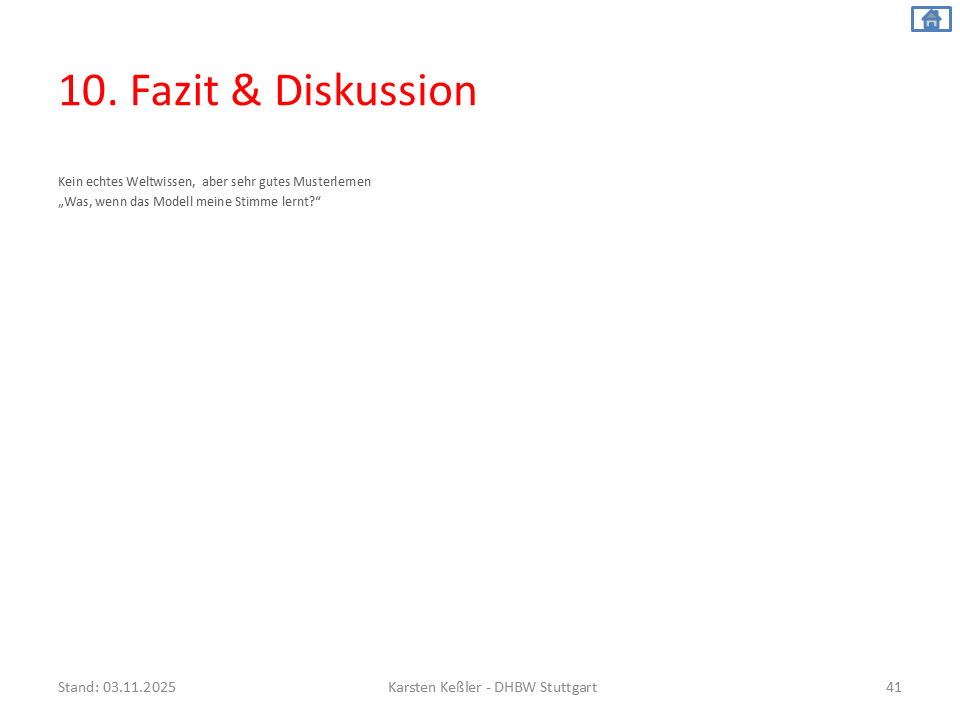

**Kurze Einordnung:**  
Grenzen von LLMs, Fazit, Ausblick und Glossar wichtiger Begriffe.

**Hinweis für die Lehre:**  
Ergänze bei Bedarf noch stichpunktartig Beispiele, Fragen oder Aufgaben,
die du zu dieser Folie stellen möchtest.
---

## Folie 42

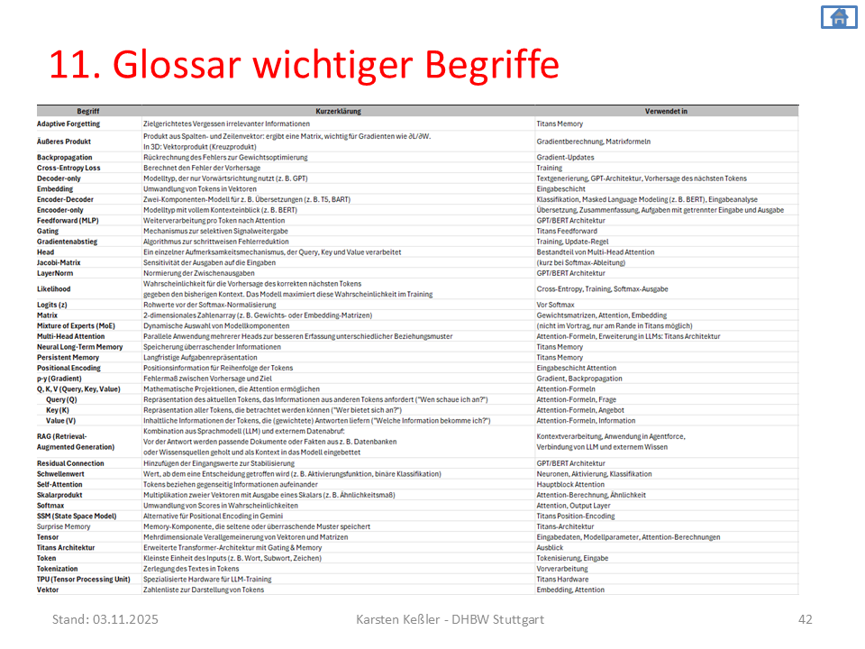

**Kurze Einordnung:**  
Grenzen von LLMs, Fazit, Ausblick und Glossar wichtiger Begriffe.

**Hinweis für die Lehre:**  
Ergänze bei Bedarf noch stichpunktartig Beispiele, Fragen oder Aufgaben,
die du zu dieser Folie stellen möchtest.
---
