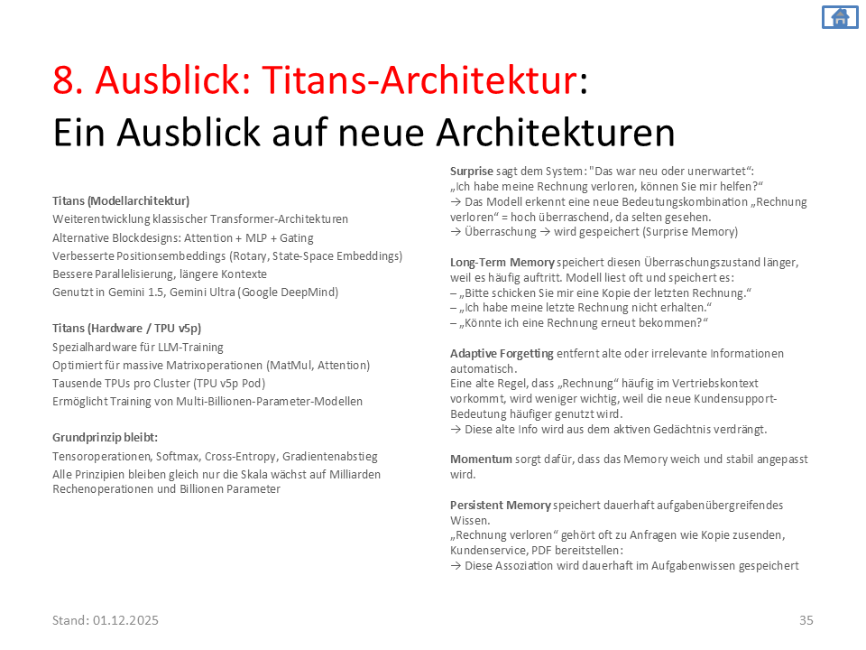

# LLM-Vorlesung – Folienskript mit Bildern und Demos

Dieses Dokument zeigt **alle Folien der Präsentation** als eingebettete PNG-Bilder.
Unter jeder Folie steht eine kurze inhaltliche Einordnung und – falls vorhanden –
Links zu passenden Python-Demos im Ordner `demos/`.

---
## Folie 0

**Kurze Einordnung:**  
Inhaltliche Ergänzung zur LLM-Vorlesung.

**Hinweis für die Lehre:**  
Ergänze bei Bedarf noch stichpunktartig Beispiele, Fragen oder Aufgaben,
die du zu dieser Folie in der Vorlesung stellen möchtest.

---

## Folie 0

**Kurze Einordnung:**  
Inhaltliche Ergänzung zur LLM-Vorlesung.

**Hinweis für die Lehre:**  
Ergänze bei Bedarf noch stichpunktartig Beispiele, Fragen oder Aufgaben,
die du zu dieser Folie in der Vorlesung stellen möchtest.

---

## Folie 0

**Kurze Einordnung:**  
Inhaltliche Ergänzung zur LLM-Vorlesung.

**Hinweis für die Lehre:**  
Ergänze bei Bedarf noch stichpunktartig Beispiele, Fragen oder Aufgaben,
die du zu dieser Folie in der Vorlesung stellen möchtest.

---

## Folie 0

**Kurze Einordnung:**  
Inhaltliche Ergänzung zur LLM-Vorlesung.

**Hinweis für die Lehre:**  
Ergänze bei Bedarf noch stichpunktartig Beispiele, Fragen oder Aufgaben,
die du zu dieser Folie in der Vorlesung stellen möchtest.

---

## Folie 0

**Kurze Einordnung:**  
Inhaltliche Ergänzung zur LLM-Vorlesung.

**Hinweis für die Lehre:**  
Ergänze bei Bedarf noch stichpunktartig Beispiele, Fragen oder Aufgaben,
die du zu dieser Folie in der Vorlesung stellen möchtest.

---

## Folie 0

**Kurze Einordnung:**  
Inhaltliche Ergänzung zur LLM-Vorlesung.

**Hinweis für die Lehre:**  
Ergänze bei Bedarf noch stichpunktartig Beispiele, Fragen oder Aufgaben,
die du zu dieser Folie in der Vorlesung stellen möchtest.

---

## Folie 0

**Kurze Einordnung:**  
Inhaltliche Ergänzung zur LLM-Vorlesung.

**Hinweis für die Lehre:**  
Ergänze bei Bedarf noch stichpunktartig Beispiele, Fragen oder Aufgaben,
die du zu dieser Folie in der Vorlesung stellen möchtest.

---

## Folie 0

**Kurze Einordnung:**  
Inhaltliche Ergänzung zur LLM-Vorlesung.

**Hinweis für die Lehre:**  
Ergänze bei Bedarf noch stichpunktartig Beispiele, Fragen oder Aufgaben,
die du zu dieser Folie in der Vorlesung stellen möchtest.

---

## Folie 0

**Kurze Einordnung:**  
Inhaltliche Ergänzung zur LLM-Vorlesung.

**Hinweis für die Lehre:**  
Ergänze bei Bedarf noch stichpunktartig Beispiele, Fragen oder Aufgaben,
die du zu dieser Folie in der Vorlesung stellen möchtest.

---

## Folie 0

**Kurze Einordnung:**  
Inhaltliche Ergänzung zur LLM-Vorlesung.

**Hinweis für die Lehre:**  
Ergänze bei Bedarf noch stichpunktartig Beispiele, Fragen oder Aufgaben,
die du zu dieser Folie in der Vorlesung stellen möchtest.

---

## Folie 0

**Kurze Einordnung:**  
Inhaltliche Ergänzung zur LLM-Vorlesung.

**Hinweis für die Lehre:**  
Ergänze bei Bedarf noch stichpunktartig Beispiele, Fragen oder Aufgaben,
die du zu dieser Folie in der Vorlesung stellen möchtest.

---

## Folie 0

**Kurze Einordnung:**  
Inhaltliche Ergänzung zur LLM-Vorlesung.

**Hinweis für die Lehre:**  
Ergänze bei Bedarf noch stichpunktartig Beispiele, Fragen oder Aufgaben,
die du zu dieser Folie in der Vorlesung stellen möchtest.

---

## Folie 0

**Kurze Einordnung:**  
Inhaltliche Ergänzung zur LLM-Vorlesung.

**Hinweis für die Lehre:**  
Ergänze bei Bedarf noch stichpunktartig Beispiele, Fragen oder Aufgaben,
die du zu dieser Folie in der Vorlesung stellen möchtest.

---

## Folie 0

**Kurze Einordnung:**  
Inhaltliche Ergänzung zur LLM-Vorlesung.

**Hinweis für die Lehre:**  
Ergänze bei Bedarf noch stichpunktartig Beispiele, Fragen oder Aufgaben,
die du zu dieser Folie in der Vorlesung stellen möchtest.

---

## Folie 0

**Kurze Einordnung:**  
Inhaltliche Ergänzung zur LLM-Vorlesung.

**Hinweis für die Lehre:**  
Ergänze bei Bedarf noch stichpunktartig Beispiele, Fragen oder Aufgaben,
die du zu dieser Folie in der Vorlesung stellen möchtest.

---

## Folie 0

**Kurze Einordnung:**  
Inhaltliche Ergänzung zur LLM-Vorlesung.

**Hinweis für die Lehre:**  
Ergänze bei Bedarf noch stichpunktartig Beispiele, Fragen oder Aufgaben,
die du zu dieser Folie in der Vorlesung stellen möchtest.

---

## Folie 0

**Kurze Einordnung:**  
Inhaltliche Ergänzung zur LLM-Vorlesung.

**Hinweis für die Lehre:**  
Ergänze bei Bedarf noch stichpunktartig Beispiele, Fragen oder Aufgaben,
die du zu dieser Folie in der Vorlesung stellen möchtest.

---

## Folie 0

**Kurze Einordnung:**  
Inhaltliche Ergänzung zur LLM-Vorlesung.

**Hinweis für die Lehre:**  
Ergänze bei Bedarf noch stichpunktartig Beispiele, Fragen oder Aufgaben,
die du zu dieser Folie in der Vorlesung stellen möchtest.

---

## Folie 0

**Kurze Einordnung:**  
Inhaltliche Ergänzung zur LLM-Vorlesung.

**Hinweis für die Lehre:**  
Ergänze bei Bedarf noch stichpunktartig Beispiele, Fragen oder Aufgaben,
die du zu dieser Folie in der Vorlesung stellen möchtest.

---

## Folie 0

**Kurze Einordnung:**  
Inhaltliche Ergänzung zur LLM-Vorlesung.

**Hinweis für die Lehre:**  
Ergänze bei Bedarf noch stichpunktartig Beispiele, Fragen oder Aufgaben,
die du zu dieser Folie in der Vorlesung stellen möchtest.

---

## Folie 0

**Kurze Einordnung:**  
Inhaltliche Ergänzung zur LLM-Vorlesung.

**Hinweis für die Lehre:**  
Ergänze bei Bedarf noch stichpunktartig Beispiele, Fragen oder Aufgaben,
die du zu dieser Folie in der Vorlesung stellen möchtest.

---

## Folie 0

**Kurze Einordnung:**  
Inhaltliche Ergänzung zur LLM-Vorlesung.

**Hinweis für die Lehre:**  
Ergänze bei Bedarf noch stichpunktartig Beispiele, Fragen oder Aufgaben,
die du zu dieser Folie in der Vorlesung stellen möchtest.

---

## Folie 0

**Kurze Einordnung:**  
Inhaltliche Ergänzung zur LLM-Vorlesung.

**Hinweis für die Lehre:**  
Ergänze bei Bedarf noch stichpunktartig Beispiele, Fragen oder Aufgaben,
die du zu dieser Folie in der Vorlesung stellen möchtest.

---

## Folie 0

**Kurze Einordnung:**  
Inhaltliche Ergänzung zur LLM-Vorlesung.

**Hinweis für die Lehre:**  
Ergänze bei Bedarf noch stichpunktartig Beispiele, Fragen oder Aufgaben,
die du zu dieser Folie in der Vorlesung stellen möchtest.

---

## Folie 0

**Kurze Einordnung:**  
Inhaltliche Ergänzung zur LLM-Vorlesung.

**Hinweis für die Lehre:**  
Ergänze bei Bedarf noch stichpunktartig Beispiele, Fragen oder Aufgaben,
die du zu dieser Folie in der Vorlesung stellen möchtest.

---

## Folie 0

**Kurze Einordnung:**  
Inhaltliche Ergänzung zur LLM-Vorlesung.

**Hinweis für die Lehre:**  
Ergänze bei Bedarf noch stichpunktartig Beispiele, Fragen oder Aufgaben,
die du zu dieser Folie in der Vorlesung stellen möchtest.

---

## Folie 0

**Kurze Einordnung:**  
Inhaltliche Ergänzung zur LLM-Vorlesung.

**Hinweis für die Lehre:**  
Ergänze bei Bedarf noch stichpunktartig Beispiele, Fragen oder Aufgaben,
die du zu dieser Folie in der Vorlesung stellen möchtest.

---

## Folie 0

**Kurze Einordnung:**  
Inhaltliche Ergänzung zur LLM-Vorlesung.

**Hinweis für die Lehre:**  
Ergänze bei Bedarf noch stichpunktartig Beispiele, Fragen oder Aufgaben,
die du zu dieser Folie in der Vorlesung stellen möchtest.

---

## Folie 0

**Kurze Einordnung:**  
Inhaltliche Ergänzung zur LLM-Vorlesung.

**Hinweis für die Lehre:**  
Ergänze bei Bedarf noch stichpunktartig Beispiele, Fragen oder Aufgaben,
die du zu dieser Folie in der Vorlesung stellen möchtest.

---

## Folie 0

**Kurze Einordnung:**  
Inhaltliche Ergänzung zur LLM-Vorlesung.

**Hinweis für die Lehre:**  
Ergänze bei Bedarf noch stichpunktartig Beispiele, Fragen oder Aufgaben,
die du zu dieser Folie in der Vorlesung stellen möchtest.

---

## Folie 0

**Kurze Einordnung:**  
Inhaltliche Ergänzung zur LLM-Vorlesung.

**Hinweis für die Lehre:**  
Ergänze bei Bedarf noch stichpunktartig Beispiele, Fragen oder Aufgaben,
die du zu dieser Folie in der Vorlesung stellen möchtest.

---

## Folie 0

**Kurze Einordnung:**  
Inhaltliche Ergänzung zur LLM-Vorlesung.

**Hinweis für die Lehre:**  
Ergänze bei Bedarf noch stichpunktartig Beispiele, Fragen oder Aufgaben,
die du zu dieser Folie in der Vorlesung stellen möchtest.

---

## Folie 0

**Kurze Einordnung:**  
Inhaltliche Ergänzung zur LLM-Vorlesung.

**Hinweis für die Lehre:**  
Ergänze bei Bedarf noch stichpunktartig Beispiele, Fragen oder Aufgaben,
die du zu dieser Folie in der Vorlesung stellen möchtest.

---

## Folie 0

**Kurze Einordnung:**  
Inhaltliche Ergänzung zur LLM-Vorlesung.

**Hinweis für die Lehre:**  
Ergänze bei Bedarf noch stichpunktartig Beispiele, Fragen oder Aufgaben,
die du zu dieser Folie in der Vorlesung stellen möchtest.

---

## Folie 0

**Kurze Einordnung:**  
Inhaltliche Ergänzung zur LLM-Vorlesung.

**Hinweis für die Lehre:**  
Ergänze bei Bedarf noch stichpunktartig Beispiele, Fragen oder Aufgaben,
die du zu dieser Folie in der Vorlesung stellen möchtest.

---

## Folie 0

**Kurze Einordnung:**  
Inhaltliche Ergänzung zur LLM-Vorlesung.

**Hinweis für die Lehre:**  
Ergänze bei Bedarf noch stichpunktartig Beispiele, Fragen oder Aufgaben,
die du zu dieser Folie in der Vorlesung stellen möchtest.

---

## Folie 0

**Kurze Einordnung:**  
Inhaltliche Ergänzung zur LLM-Vorlesung.

**Hinweis für die Lehre:**  
Ergänze bei Bedarf noch stichpunktartig Beispiele, Fragen oder Aufgaben,
die du zu dieser Folie in der Vorlesung stellen möchtest.

---

## Folie 0

**Kurze Einordnung:**  
Inhaltliche Ergänzung zur LLM-Vorlesung.

**Hinweis für die Lehre:**  
Ergänze bei Bedarf noch stichpunktartig Beispiele, Fragen oder Aufgaben,
die du zu dieser Folie in der Vorlesung stellen möchtest.

---

## Folie 0

**Kurze Einordnung:**  
Inhaltliche Ergänzung zur LLM-Vorlesung.

**Hinweis für die Lehre:**  
Ergänze bei Bedarf noch stichpunktartig Beispiele, Fragen oder Aufgaben,
die du zu dieser Folie in der Vorlesung stellen möchtest.

---

## Folie 0

**Kurze Einordnung:**  
Inhaltliche Ergänzung zur LLM-Vorlesung.

**Hinweis für die Lehre:**  
Ergänze bei Bedarf noch stichpunktartig Beispiele, Fragen oder Aufgaben,
die du zu dieser Folie in der Vorlesung stellen möchtest.

---

## Folie 0

**Kurze Einordnung:**  
Inhaltliche Ergänzung zur LLM-Vorlesung.

**Hinweis für die Lehre:**  
Ergänze bei Bedarf noch stichpunktartig Beispiele, Fragen oder Aufgaben,
die du zu dieser Folie in der Vorlesung stellen möchtest.

---

## Folie 0

**Kurze Einordnung:**  
Inhaltliche Ergänzung zur LLM-Vorlesung.

**Hinweis für die Lehre:**  
Ergänze bei Bedarf noch stichpunktartig Beispiele, Fragen oder Aufgaben,
die du zu dieser Folie in der Vorlesung stellen möchtest.

---

